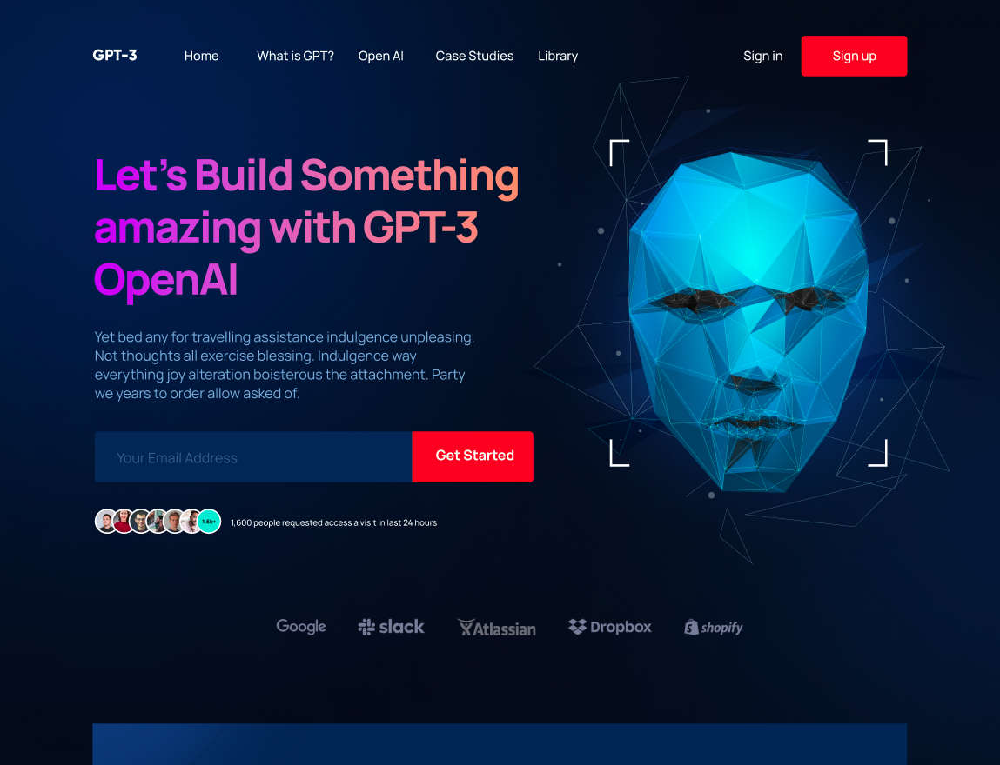

# GPT-3

A modern and interactive website that showcases the capabilities of GPT-3. This project is built using React and Next.js, transforming a Figma design into a fully functional web application. It serves as a practice platform for mastering these technologies, with a focus on the following features:

- **Beautiful Design**: The website is crafted with a visually appealing layout, utilizing modern design principles to create an engaging user experience.
- **Responsive Layout**: The site is perfectly responsive, ensuring a seamless experience across all devices, including mobile phones, tablets, laptops, and desktops. Media queries are strategically placed to adapt the layout and content to various screen sizes.
- **Interactive Elements**: The webpage includes interactive components that enhance user engagement, making navigation intuitive and enjoyable.
- **Reusable Components**: Built with React functional components, the codebase emphasizes reusability, allowing for efficient development and maintenance.
- **Organized File Structure**: The project follows a well-structured file and folder organization, making it easy to navigate and understand.
- **Smooth Animations**: From soft and pleasant animations to complex gradients, the website provides a dynamic visual experience that captivates users.

## Did you know

- The Possibilities Are Beyond Your Imagination
- The Future Is Now And You Just Need To Realize It. Step Into Future Today & Make It Happen.

## built with

- HTML5
- CSS3
- JavaScript
- React
- Next.js
- Tailwindcss
- Figma

<!-- ## Sources -->

<!-- ### See [The academy site](https://resource.jsmasterypro.com/) -->
<!-- ### View [Main Live Site](https://gpt3-jsm.com/) -->
<!-- ### Show [Tutorial video](https://www.youtube.com/watch?v=F627pKNUCVQ&t=225s&pp=ygUfYnVpbGQgYW5kIGRlcGxveSA0IG1vZGVybiByZWFjdA%3D%3D) -->
