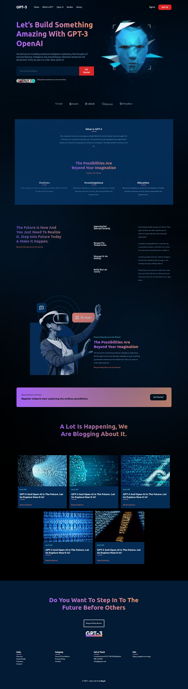

# GPT-3

A modern and interactive website that showcases the capabilities of GPT-3. Transformed a Figma design into a responsive, fully functional website using React and Next.js to practice front-end development skills.

## Key highlights include

- **Responsive Design**: Ensures smooth display and usability across all devices, with AOS scroll animations adding a touch of interactivity.
- **Cross-Browser** Compatibility: Built to provide a consistent, user-friendly experience across major browsers.
- **Optimized Performance**: All images are compressed and served in WebP format for faster load times.
- **Reusable Components**: Leveraged React components for modularity and efficient maintenance.
- **Organized Structure**: Follows a clean file structure, making the codebase easy to understand and extend."

## Built with

- HTML5
- CSS3
- JavaScript
- React
- Next.js
- Tailwindcss
- Figma

## Sources & Reference

JavaScript Mastery:

- The figma design: https://www.figma.com/design/cLyVGrGf1qIdXG3IEJFb46/gpt3-(Copy)?node-id=0-15&t=aYQWR0vRWXhiHYzY-1
- The main video tutorial: https://www.youtube.com/watch?v=LMagNcngvcU&list=PL6QREj8te1P6CkO_4OIK1-nwG5OxCD5tR
